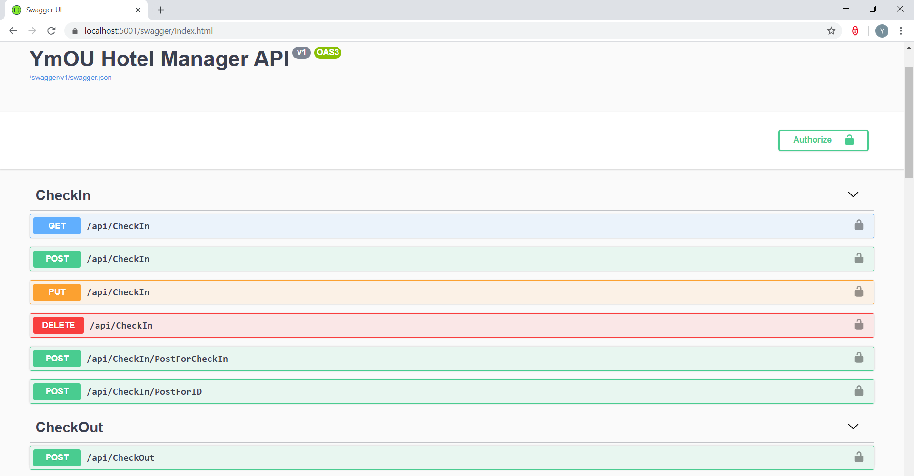

# Hotel Management System (.NET Core)

<ul>
  <li> Upgraded the Hotel Management app from .NET Framework4.7 to .NET Core3.1. </li>
  <li> Dependency Injection was introduced to the middle Web API layer using ASP.NET Core's built-in service container. </li>
  <li> User Authentication and Authorization was implemented with JSON Web Token (<strong>JWT</strong>) and Swagger. </li>
</ul>

<h3> API Endpoints </h3>

<h3> Token Authentication</h3>

<h3> Token Authorization </h3>

<h3> Authorized Access of Data </h3>

