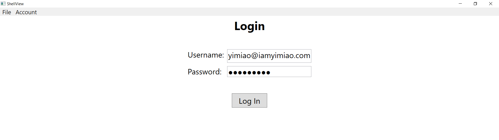

# Hotel Management System (C# .NET Core)
<ul>
  <li> A desktop application built with .NET Framework4.7 that allows managing User Data Access, Hotel Rooms, Clients, Check-ins, Checkouts and Check in/out Reports with Authentication and Role Based Authorization. </li>
  <li> Front-end was implemented with Windows Presentation Foundation (<strong>WPF</strong>) using Caliburn Micro's MVVM pattern and Dependency Injection container. </li>
  <li> A middle Web API layer that services the front-end was created using ASP.NET MVC and Web API, Authentication and Authorization with Swagger documentation, and Async/Await. </li>
  <li> Back-end data was managed by Microsoft SQL Server and stored/accessed through Class Library using Dapper as Object Relational Mapper (ORM) . </li> 
  <li> Upgraded the application from .NET Framework4.7 to .NET Core3.1 and implemented Dependency Injection in the middle Web API layer using ASP.NET Core's built-in service container and Authentication and Authorization using JSON Web Token (<strong>JWT</strong>).</li>
</ul>

<h3> Swagger was used to document the Web API Endpoints</h3>

 
 

<h3> Token Authentication </h3>

<h3> Token Authorization </h3>

<h3> Only authorized user can access data in the API Endpoints </h3>

<h3> Successful login allows the display of app menus on top of the shell window </h3>

<h3> Only User with Admin role is allowed to manage the User Roles </h3>

<h3> Unauthorized User is banned from manipulating the User Roles </h3>

<h3> Room View displays all room information and allows Add, Edit and Remove room information from the table and SQL database </h3>

<h3> Client View displays all client information and allows Add, Edit and Remove client information from the table and SQL database. Selecting a client in the table and clicking the "Switch To Check In" button allows switching to the CheckIn View and automatically filling in available CheckIn information for the selected client. </h3>

<h3> CheckIn View allows displaying information for an already checked-in client if typing in the client name. For new checkIn, client needs to register in Client view first and then fill in required information to check in. CheckIn View also allows clearing the filled-in fields and removing CheckIn information from the SQL database. </h3>

<h3> Select one room type from the Room Type drop-down list will display the available rooms of the chosen type in the Room Number drop-down list. When a room number is chosen, the corresponding room capacity and price info will be automatically filled in. </h3>

<h3> CheckOut View allows display of the checkOut information when typing in the room number that needs to check out. Clicking the "Check Out" button will store the CheckOut information and update the corresponding CheckIn and Room Availability information in the SQL database. </h3>

<h3> A warning message will show up if typing in wrong room number for CheckOut </h3>

